# Ivory AI — AI Chatbot & Virtual Receptionist for Local Businesses

> **Live:** [ivoryai.net](https://ivoryai.net) | **Status:** Active Development | **Source Code:** Private

Ivory AI is a production-grade SaaS platform that gives local businesses an AI-powered virtual receptionist. It answers customer questions 24/7, captures leads automatically, and handles after-hours visitors — starting at $97/month with a 30-day free trial. Built end-to-end as a solo developer: backend, frontend, AI engine, scraping pipeline, email outreach, payments, and infrastructure.

---

## Live Product Screenshots

### Landing Page

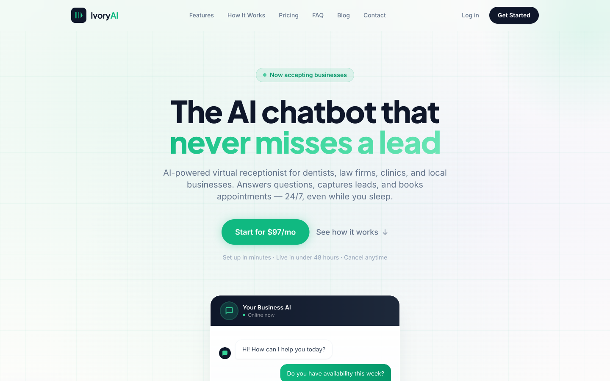

The hero section with animated stats showing **24/7 availability**, **<2s response time**, and **$0 setup fee**. Designed to immediately communicate value with a clear CTA and live demo link.

---

### The Problem We Solve

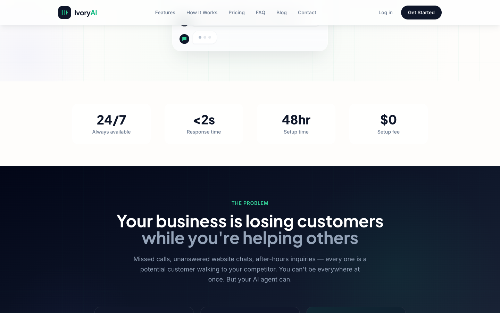

**35% of customer inquiries go unanswered** outside business hours — that's **$500+ in lost revenue** per missed opportunity. Ivory AI makes sure no lead slips through the cracks.

---

### How It Works

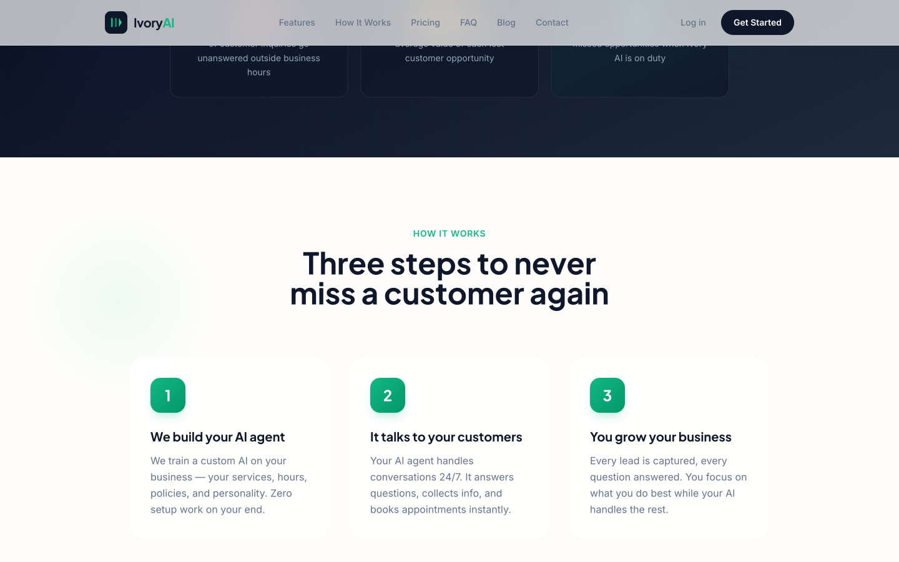

Three-step process: **We build your AI agent** from your website data → **It talks to your customers** 24/7 → **You grow your business** with captured leads and booked appointments.

---

### Features

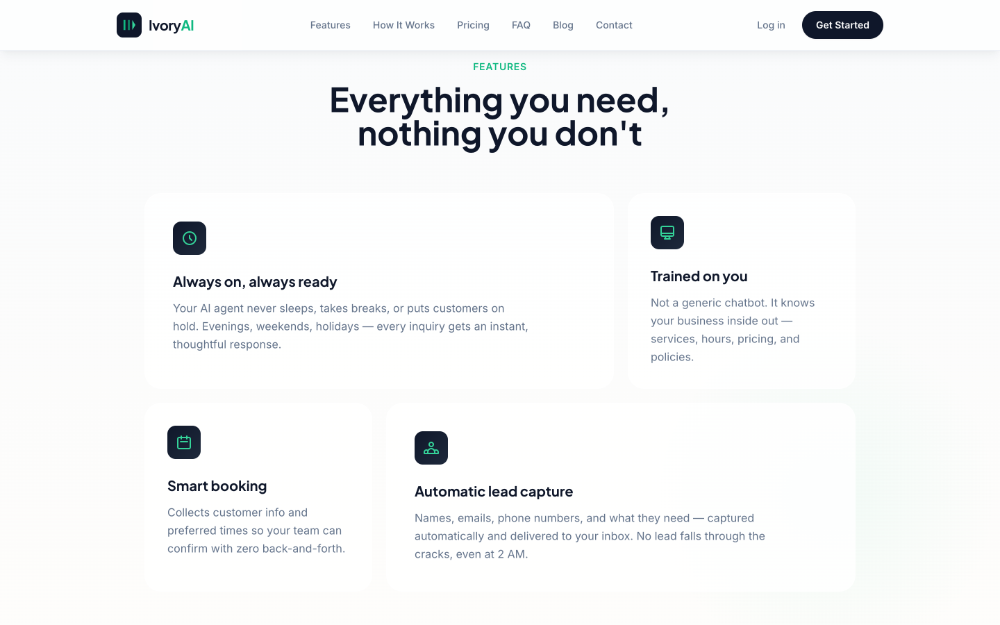

Always-on availability, trained on your actual business data, smart booking integration, and automatic lead capture — all without lifting a finger.

---

### Cost Comparison

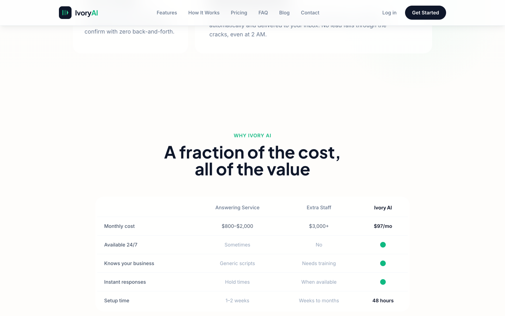

Ivory AI at **$97/mo** vs. answering services (**$800–$2,000/mo**) vs. hiring extra staff (**$3,000+/mo**). The economics speak for themselves.

---

### Pricing

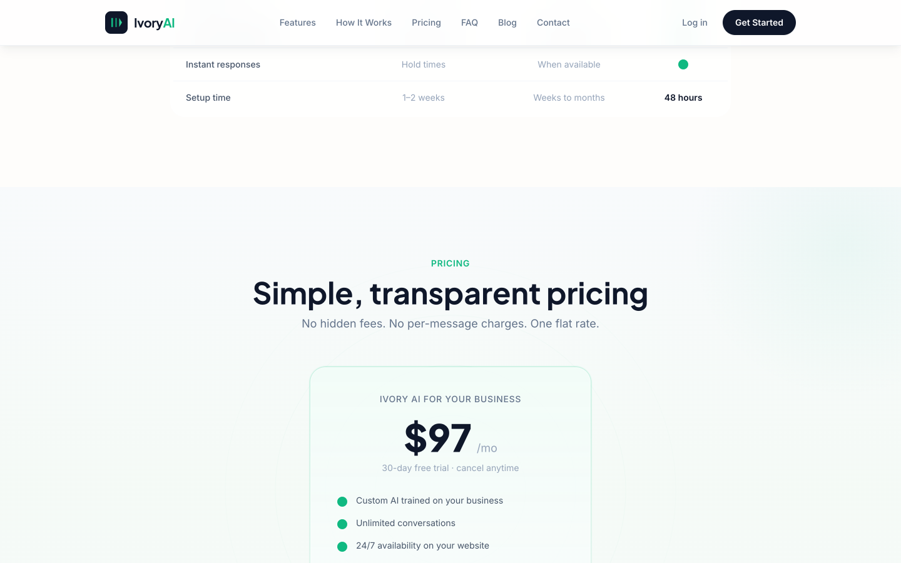

One plan. One price. **30-day free trial** with no credit card required. Cancel anytime.

---

## AI Chatbot In Action

### Live Chatbot Widget

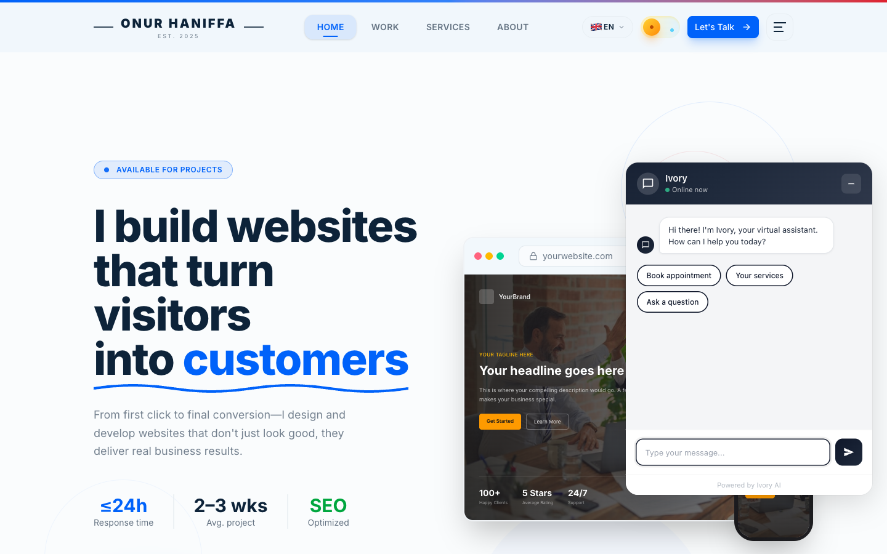

The Ivory AI chatbot widget deployed on a real client website ([onurhaniffa.com](https://onurhaniffa.com)), showing the greeting message with quick-action buttons for common inquiries.

---

### Real AI Conversation

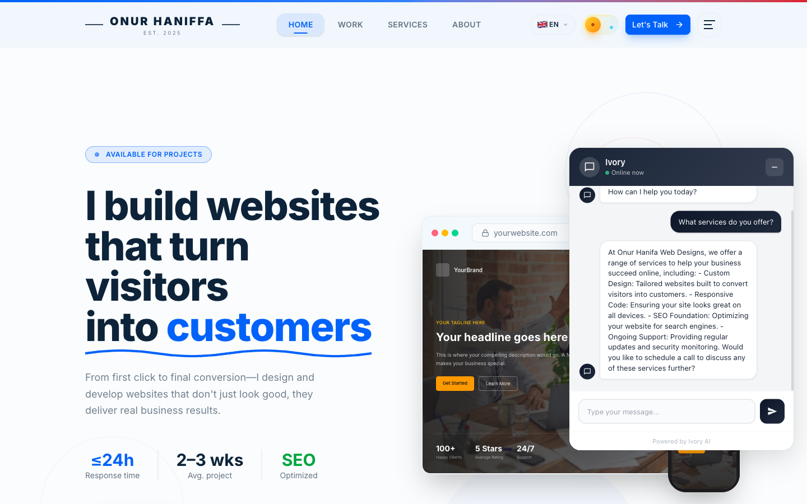

A live conversation where the AI answers **"What services do you offer?"** with a detailed, personalized response generated from the business's scraped website data. Every response is unique to the business — no generic templates.

---

## Industry-Specific Landing Pages

### Dental Practices

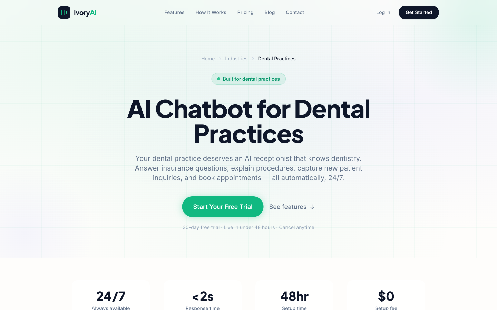

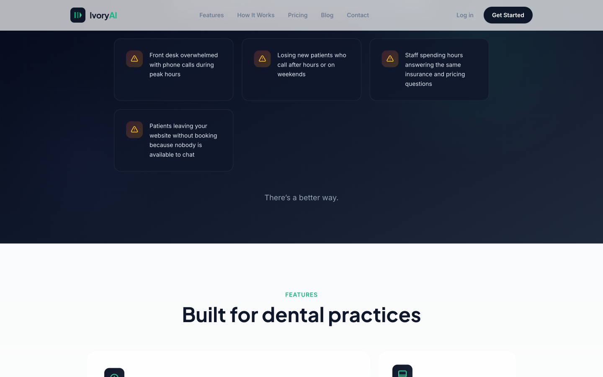

**24+ SEO-optimized landing pages** for different industries and cities, each with industry-specific pain points, features, and social proof tailored to that vertical.

---

### Demo Section & Industries

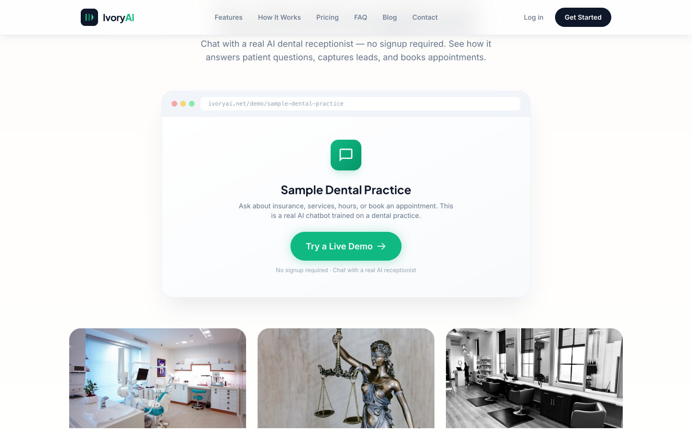

Live demo section with direct links to try the AI receptionist, plus industry cards for **Healthcare**, **Professional Services**, and **Local Businesses** — each linking to dedicated landing pages.

---

## Technical Architecture

```
┌─────────────────────────────────────────────────────────────────┐
│                        IVORY AI PLATFORM                        │
├─────────────┬──────────────┬──────────────┬─────────────────────┤
│  Scraping   │   Chatbot    │   Outreach   │   Customer Portal   │
│  Pipeline   │   Engine     │   System     │   & Dashboard       │
├─────────────┼──────────────┼──────────────┼─────────────────────┤
│ Google Maps │ OpenAI GPT-4 │ Resend Email │ JWT Auth + Sessions │
│ Playwright  │ Dynamic      │ Open/Click   │ Widget Customizer   │
│ Website     │ Prompts from │ Tracking     │ Conversation Viewer │
│ Analyzer    │ Scraped Data │ Follow-up    │ Lead Management     │
│ Hunter.io   │ Lead Capture │ Automation   │ Billing Portal      │
├─────────────┴──────────────┴──────────────┴─────────────────────┤
│              FastAPI + SQLAlchemy + PostgreSQL                   │
│              Docker + Railway Deployment                        │
└─────────────────────────────────────────────────────────────────┘
```

| Layer | Technologies |
|-------|-------------|
| **Backend** | Python, FastAPI, SQLAlchemy 2.0 (async), Alembic, PostgreSQL |
| **AI Engine** | OpenAI GPT-4o-mini with dynamic prompt generation from scraped business data |
| **Scraping Pipeline** | Playwright (headless, anti-detection), BeautifulSoup, Hunter.io |
| **Email System** | Resend API with open/click tracking, timezone-aware sending windows |
| **Payments** | Lemon Squeezy with HMAC-SHA256 webhook verification |
| **Auth** | PyJWT + bcrypt, HTTP-only cookies, rate limiting, account lockout |
| **Frontend** | Tailwind CSS, Jinja2, Alpine.js, embeddable chat widget (~400 lines JS) |
| **Infrastructure** | Docker, Railway, APScheduler |

---

## Key Metrics

| Metric | Value |
|--------|-------|
| Automated Tests | **141+** |
| Source Files | **100+** |
| Database Models | **5** (80+ columns) |
| API Route Modules | **11** |
| DB Migrations | **8** |
| Chatbot Provider Detections | **23+** |
| Booking Platform Detections | **15+** |
| SEO Landing Pages | **24+** |

---

## Key Technical Achievements

- **Anti-detection scraping** — Randomized user agents, viewports, stealth scripts, and consent dialog handling with Outscraper API fallback
- **Dynamic AI prompt generation** — 2000+ character system prompts built from scraped business data (services, hours, insurance, team, FAQ)
- **Multi-strategy webhook matching** — Lemon Squeezy webhooks matched via email, customer ID, or subscription metadata
- **Security hardening** — CSRF middleware, CSP headers, HSTS, production startup guards that crash the app if default secrets are unchanged
- **Timing attack prevention** — bcrypt always runs on login, even for non-existent accounts
- **Full email pipeline** — Personalized outreach with 7-day follow-ups, open/click tracking, timezone-aware sending, HMAC-signed unsubscribe URLs
- **Website intelligence** — Detects 23+ chatbot providers, 15+ booking platforms, 9+ CMS platforms, SSL, mobile viewport, social links
- **Opportunity scoring** — Algorithm scores businesses 0–10 based on detected gaps to prioritize outreach
- **Session management** — LRU eviction with max 1000 concurrent chatbot sessions
- **Embeddable widget** — Self-contained ~400-line JS widget with theme system, responsive design, accessibility support

---

## Built By

**Onur Haniffa** — Full-Stack Developer & ML Engineer

I built this entire platform solo — backend, frontend, infrastructure, security, email system, payment integration, AI chatbot engine, scraping pipeline, and SEO. Every line of code, every database migration, every test.

[Portfolio](https://onurhaniffa.com) · [LinkedIn](https://linkedin.com/in/onurhaniffa) · [GitHub](https://github.com/OnurHaniffa)
